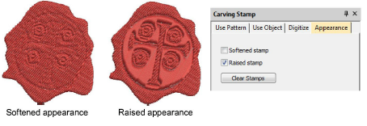

# Carving stamp > appearance

The Appearance tab allows you to soften or intensify the effect. Use the Softened Stamp and Raised Stamp options on the Appearance tab to soften or accentuate the effect.

## Related topics

- [Creating patterns with custom splits](../../Decorative/patterns/Creating_patterns_with_custom_splits)
- [Carving stamp appearance](../../Decorative/patterns/Carving_stamp_appearance)
