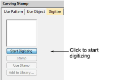

# Carving stamp > digitize

The Digitize tab allows you to digitize split lines and apply or to any applicable objects in the design window.

## Related topics

- [Creating patterns with custom splits](../../Decorative/patterns/Creating_patterns_with_custom_splits)
- [Digitize custom splits](../../Decorative/patterns/Digitize_custom_splits)
