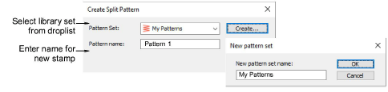

# Carving stamp > use objects

The Use Object tab allows you to select object outlines from the design window and apply them directly as stamps or save them to a library for future reference. You can use vector or embroidery objects as a basis for stamps.

## Create Split Pattern

The Create Split Pattern dialog lets you save custom splits for use with the Carving Stamp tool. The New Pattern Set dialog lets you create new pattern sets to store custom splits for later use.

## Related topics

- [Use objects as carving stamps](../../Decorative/patterns/Use_objects_as_carving_stamps)
- [Add stamps to a library](../../Decorative/patterns/Add_stamps_to_a_library)
