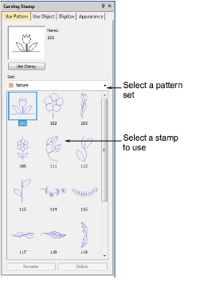
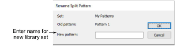

# Carving stamp > use patterns

The Use Pattern tab lets you select and apply predefined stamp patterns. You can start with or without embroidery objects selected. If one or more objects is selected, stamps are only applied to selected objects. If no object is pre-selected, stamps can be applied to any objects.

## Rename split pattern

The Rename Split Pattern dialog lets you rename custom splits used with the Carving Stamp tool.

## Related topics

- [Creating patterns with carving stamps](../../Decorative/patterns/Creating_patterns_with_carving_stamps)
- [Apply predefined patterns](../../Decorative/patterns/Apply_predefined_patterns)
