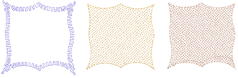
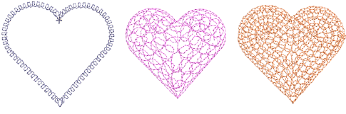

# Chenille-style patterns

EmbroideryStudio provides a number of stitch patterns traditionally associated with chenille work – Square, Double Square, Coil, and Island Coil. The pattern you use depends on input tool used as well as object shape, size and the effect you want to achieve.

## Square stitch patterns

|              | Use Outline Stitch Types > Square to create open borders or columns of even width for an open ‘toothed’ effect. Right-click for settings. |
| -------------------------------------------- | ----------------------------------------------------------------------------------------------------------------------------------------- |
|    | Use Fill Stitch Types > Square to create open straight parallel fills. Right-click for settings.                                          |
|  | Use Fill Stitch Types > Double Square to create grid fills. Apply closed shapes. Right-click for settings.                                |

Square is similar to Tatami and is suitable for narrow objects digitized with most closed-object input methods. You could obtain a similar effect using open tatami with borderline backstitch, but Square stitch makes it simpler to achieve. Stitch angles have no effect on this stitch type.

## Coil stitch patterns

|              | Use Outline Stitch Types > Coil to create borders or columns of even width for an open ‘coil’ effect. Right-click to adjust settings.                                                                      |
| ---------------------------------------- | ---------------------------------------------------------------------------------------------------------------------------------------------------------------------------------------------------------- |
|  | Use Fill Stitch Types > Island Coil to fill large Complex Fill objects with concentric rows of coil stitching, simulating the circular motion of hand-chenille embroidery. Right-click to adjust settings. |
|    | Use Fill Stitch Types > Coil to stitch narrow shapes or columns where each stitch traverses the column width. Right-click to adjust settings.                                                              |

Coil is equivalent to Satin in regular embroidery. Stitches are generated in spirals. Stitch length is consistent even over different widths. Coil is generally suited to narrow shapes or columns where each stitch traverses the width of the column. Stitch angles have no effect on this stitch type.

## Related topics

- [Access object properties](../../Basics/basics/Access_object_properties)
- [Chenille patterns](../../Decorative/specialty/Chenille_patterns)
