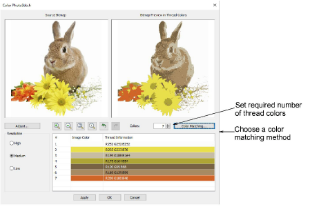
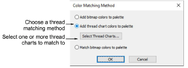

# Color PhotoStitch

|  | Use Auto-Digitizing > Color PhotoStitch to automatically turn photographs and other bitmap artwork into multi-colored embroidery. |
| ---------------------------------------------------- | --------------------------------------------------------------------------------------------------------------------------------- |
|          | Use Auto-Digitizing > Adjust Bitmap to adjust image lightness and contrast in preparation for auto-digitizing.                    |

Use Color PhotoStitch to create embroidery from photographs and other images. While Photo Flash designs consist of rows of single-color satin stitching, Color PhotoStitch produces variegated stitching using multiple thread colors. The overall effect is like multi-colored stippling. For best results, use crisp images with well-defined subjects and constantly varying shades.

## Color Matching Method

Use Color Matching Method to assign image colors to the color palette for manual thread matching. This ensures the best representation. Alternatively, automatically match them to the current color palette or current thread chart. Select one or more available thread charts to match to.

## Related video

<iframe src="https://www.youtube.com/embed/q-IwO2ySkqI" frameborder="0" 
		 allow="accelerometer; autoplay; encrypted-media; gyroscope; picture-in-picture" 
		 allowfullscreen="" style="width: 560px; height: 315px;">

&#160;

</iframe>

## Related topics

- [Auto-digitize with Color PhotoStitch](../../Automatic/automatic/Auto-digitize_with_Color_PhotoStitch)
