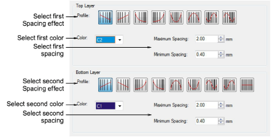

# Color blends

|  | Use Toolbox > Color Blending to generate color blends, perspective effects and shading in selected objects. |
| ---------------------------------------------- | ----------------------------------------------------------------------------------------------------------- |

From sunsets to wood grains, Color Blending creates interesting color blends. Use it with standard tatami to create depth and shading. Two colors are merged smoothly from one to another using a mixture of dense and open fill. Use the Color Blending dialog to select these effects and adjust settings.

## Related video

<iframe src="https://www.youtube.com/embed/f_HV1Hg37e0" frameborder="0" 
		 allow="accelerometer; autoplay; encrypted-media; gyroscope; picture-in-picture" 
		 allowfullscreen="" style="width: 560px; height: 315px;">

&#160;

</iframe>

## Related video

<iframe src="https://www.youtube.com/embed/pFEJMT9Silc" frameborder="0" 
		 allow="accelerometer; autoplay; encrypted-media; gyroscope; picture-in-picture" 
		 allowfullscreen="" style="width: 560px; height: 315px;">

&#160;

</iframe>

## Related topics

- [Gradient stitching](../../Decorative/specialty/Gradient_stitching)
- [Color blends](../../Decorative/specialty/Color_blends)
