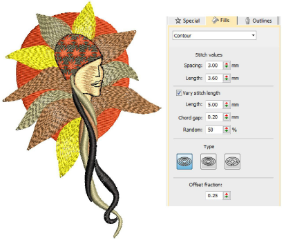

# Contoured fills

|        | Use Fill Stitch Types > Contour to create fills which follow object contours, creating a curved, light-and-shade effect. Right-click for settings.       |
| ------------------------------------------------ | -------------------------------------------------------------------------------------------------------------------------------------------------------- |
|  | Use Outline Stitch Types > Contour to create outlines which follow object contours, creating a curved, light-and-shade effect. Right-click for settings. |

Contour is a curved fill stitch type which can be applied to Column A/B or Circle/Ring objects. It can also be used to create borders which follow object contours, creating a curved, light-and-shade effect. Use it to create a sense of movement in contrast to flatter fills created by tatami stitching. Settings can be accessed via Object Properties > Outlines and Object Properties > Fills tabs.

## Related video

<iframe src="https://www.youtube.com/embed/xJq1F5pHwAI" frameborder="0" 
		 allow="accelerometer; autoplay; encrypted-media; gyroscope; picture-in-picture" 
		 allowfullscreen="" style="width: 560px; height: 315px;">

</iframe>

## Related topics

- [Access object properties](../../Basics/basics/Access_object_properties)
- [Contoured fills](../../Decorative/curves/Contoured_fills)
