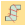

# Convert vector & embroidery objects

|              | Use Mode > Tag Fill as Turning Satin to tag narrow shapes for conversion to turning stitching.                         |
| -------------------------------------------------------------------------- | ---------------------------------------------------------------------------------------------------------------------- |
|        | Use Mode > Match to Embroidery Palette to toggle on/off thread color matching for converted vector objects.            |
|                          | Use Mode > Tag as Photo Flash to convert photos to Photo Flash embroidery from CorelDRAW Graphics.                     |
|  | Use Mode > Convert Embroidery to Graphics to convert selected embroidery to graphics and switch to CorelDRAW Graphics. |
|  | Use Mode > Convert Graphics to Embroidery to convert selected graphics to embroidery and switch to Wilcom Workspace.   |
|                  | Use Mode > Keep Graphic Objects to retain the original graphics during conversion.                                     |

EmbroideryStudio lets you convert vector graphics directly to embroidery objects using a variety of techniques. Similarly, you can convert embroidery designs or objects to vector graphics. You can also convert between different [Run](../../glossary/glossary) and [Column C](../../glossary/glossary) objects. This is useful when [scaling](../../glossary/glossary) designs – e.g. for creating thicker or thinner columns and borders.

## Related video

<iframe src="https://www.youtube.com/embed/5Sqab5N2y8o" frameborder="0" 
		 allow="accelerometer; autoplay; clipboard-write; encrypted-media; gyroscope; picture-in-picture" 
		 allowfullscreen="" style="width: 560px; height: 315px;">

&#160;

</iframe>

## Related video

<iframe src="https://www.youtube.com/embed/q1zVNto4nVw" frameborder="0" 
		 allow="accelerometer; autoplay; encrypted-media; gyroscope; picture-in-picture" 
		 allowfullscreen="" style="width: 560px; height: 315px;">

&#160;

</iframe>

## Related topics

- [Convert objects with CorelDRAW Graphics](../../Automatic/automatic/Convert_objects_with_CorelDRAW_Graphics)
- [Creating lettering with CorelDRAW Graphics](../../Lettering/lettering_create/Creating_lettering_with_CorelDRAW_Graphics)
