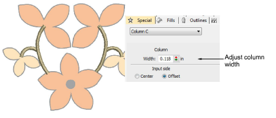

# Create columns & borders

|  | Use Traditional Digitizing > Column C to digitize columns or borders of fixed width. Right-click for settings. |
| -------------------------------- | -------------------------------------------------------------------------------------------------------------- |

Digitize columns and borders of fixed width with the Column C tool. The Special > Column C tab lets you specify values for offset and column width.

## Related topics

- [Create columns & borders](../../Digitizing/input/Create_columns_borders)
- [Digitizing regular columns](../../Digitizing/input/Digitizing_regular_columns)
- [Adjust column width & offset](../../Digitizing/input/Adjust_column_width_offset)
- [Set corner fractions](../../Digitizing/input/Set_corner_fractions)
