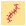
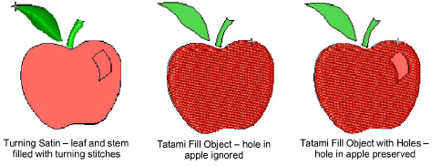

# Create fills with Auto-Digitizing

|                  | Use Auto-Digitizing > Color Matching Method to select a matching method.                                             |
| ---------------------------------------------------------------- | -------------------------------------------------------------------------------------------------------------------- |
|                      | Use Auto-Digitizing > Turning Satin Object to fill narrow column shapes with turning stitch angles.                  |
|                | Use Auto-Digitizing > Tatami Fill Object with Holes to fill large areas with tatami stitching, preserving any holes. |
|  | Use Auto-Digitizing > Tatami Fill Object to fill large areas with tatami stitching, ignoring any holes.              |
|                          | Use Auto-Digitizing > Centerline Run Object to create centerlines in narrow shapes with run stitching.               |
|                          | Use Auto-Digitizing > Outline Run Object to create outlines of run stitching.                                        |

The Auto-Digitizing tools provide everything necessary to automatically digitize shapes in electronic [artwork](../../glossary/glossary#artwork), both [bitmap](../../glossary/glossary#bitmap) and [vector](../../glossary/glossary), without using manual digitizing methods. These tools are useful for turning scanned images into embroidery designs that do not require particular artistic effects or embroidery-specific knowledge. If you are using a [vector](../../glossary/glossary) graphic, it must include a fill color. Auto-Digitizing can be used to create tatami fills as well as objects with turning satin. Use it also to digitize outlines and details with run stitching. [Current properties](../../glossary/glossary) are applied.

## Related topics

- [Auto-digitize individual shapes](../../Automatic/automatic/Auto-digitize_individual_shapes)
