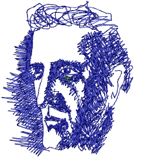

# Create freehand shapes

|  | Use Graphics Digitizing > Freehand Open Shape to draw ‘freehand’ outlines on screen.         |
| -------------------------------------------------------- | -------------------------------------------------------------------------------------------- |
|          | Use Graphics Digitizing > Freehand Closed Shape to draw ‘freehand’ closed objects on screen. |

Accessed from the Graphics Digitizing toolbar, the freehand feature is deployed in two forms: ‘Open Shape’ and ‘Closed Shape’. As with other digitizing tools, freehand tools can be used in conjunction with all stitch types. With these tools, however, you draw objects directly onscreen. It is thus possible to produce artistic effects similar to free-motion machine embroidery or ‘thread painting’.

Tip: The Freehand tools can be operated with a mouse or WACOM pen.

## Related video

<iframe src="https://www.youtube.com/embed/elFkOD_-W9U" frameborder="0" 
		 allow="accelerometer; autoplay; encrypted-media; gyroscope; picture-in-picture" 
		 allowfullscreen="" style="width: 560px; height: 315px;">

&#160;

</iframe>

## Related topics

- [Freehand embroidery](../../Decorative/specialty/Freehand_embroidery)
