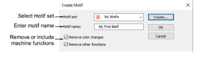
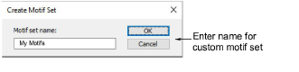
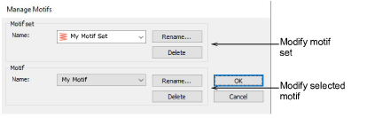

# Create motifs

The Create Motif function lets you save your own motifs for future use. Motifs may be saved to different files or ‘motif sets’.

Use the Create Motif Set dialog to create your own motif sets to organize and classify your motifs.

Manage your custom motif sets via the Manage Motifs command.

## Related video

<iframe src="https://www.youtube.com/embed/OMMcuG8Kdq0" frameborder="0" 
		 allow="accelerometer; autoplay; encrypted-media; gyroscope; picture-in-picture" 
		 allowfullscreen="" style="width: 560px; height: 315px;">

&#160;

</iframe>

## Related topics

- [Create & save motifs](../../Decorative/motifs/Create_save_motifs)
- [Manage custom motifs](../../Decorative/motifs/Manage_custom_motifs)
