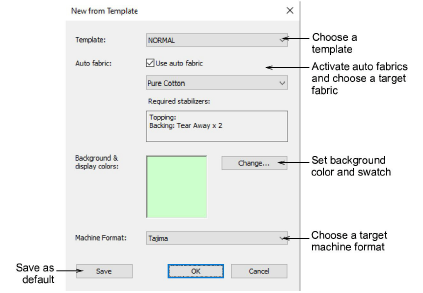

# Create new designs

|  | Use Standard > New Design to start a blank design based on the currently selected template. |
| -------------------------- | ------------------------------------------------------------------------------------------- |

Templates are special files used to store styles, [default properties](../../glossary/glossary), as well as fabric settings. Although the NORMAL template settings are suitable for a range of fabrics, selecting an auto fabric further adjusts settings.

## Related topics

- [Create designs from templates](../../Basics/basics/Create_designs_from_templates)
