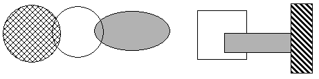
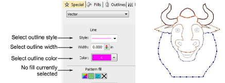

# Create vector shapes

|  | Use Outline Stitch Types > Vector Outline to create vector outlines with no stitch properties applying. |
| ---------------------------------------------- | ------------------------------------------------------------------------------------------------------- |
|        | Use Fill Stitch Types > Vector Fill to create vector fills with no stitch properties applying.          |

EmbroideryStudio lets you ‘draft’ shapes and outlines on screen. You can set colors for outlines as well as fills. [Vector objects](../../glossary/glossary) can be converted to embroidery objects with the application of manual input methods and stitch types.

## Vector properties

In EmbroideryStudio, every object is comprised of a set of object properties. The Object Properties docker lets you view and edit these. The Special > Vector tab lets you select styles for outline and fill to color drawing objects.

## Related topics

- [Create vectors](../../Automatic/vectors/Create_vectors)
- [Color vectors](../../Automatic/vectors/Color_vectors)
