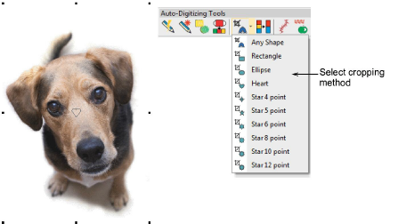

# Crop bitmap images

|        | Use Auto-Digitizing > Crop Bitmap to crop bitmap artwork for use with auto-digitizing.                                |
| -------------------------------------------- | --------------------------------------------------------------------------------------------------------------------- |
|      | Click Auto-Digitizing > Remove Crop to remove any crop areas applying to selected artwork.                            |
|  | Click Auto-Digitizing > Finalize Crop to make the cropping permanent. Once finalized, the cropping cannot be removed. |

Before using [bitmap](../../glossary/glossary) images for design purposes, crop them to remove unnecessary detail and save processing time. EmbroideryStudio allows you to ‘soft crop’ images which means that you can redefine or remove the cropping area at any stage.

Tip: To remove a cropping area, select all reshape nodes and press Delete.

## Related topics

- [Crop bitmap images](../../Automatic/bitmaps/Crop_bitmap_images)
