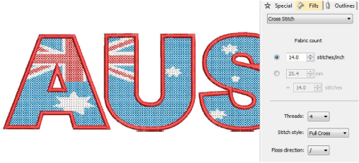

# Cross stitch fills

|  | Use Fill Stitch Types > Cross Stitch to fill large areas with low stitch count cross-stitch fills. |
| -------------------------------------------------- | -------------------------------------------------------------------------------------------------- |

Cross stitching is a popular technique for filling large areas with low stitch counts. Cross stitch is also sometimes combined with appliqué. Cross Stitch fill is something like Motif Fill but is generated differently. Crosses in different objects line up precisely if using the same fabric count. Adjust settings with the Object Properties > Fills > Cross Stitch tab.

Tip: Cross Stitch fill is a stitch type in its own right but does not replace the ES Cross Stitch application available via the Special menu. See also EmbroideryStudio Cross Stitch Supplement.

## Related topics

- [Access object properties](../../Basics/basics/Access_object_properties)
- [Cross stitch fills](../../Decorative/specialty/Cross_stitch_fills)
