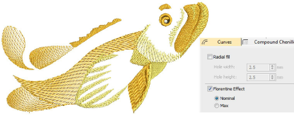

# Curved fills

|  | Use Stitch Effects > Florentine Effect to create custom curved stitching.               |
| ---------------------------------------------------- | --------------------------------------------------------------------------------------- |
|          | Use Stitch Effects > Liquid Effect to create curved stitch effects with two guidelines. |

To apply the effect to new [complex fill](../../glossary/glossary#complex-fill) objects, select Florentine Effect before starting. The effect can also be applied to [Column A/B](../../glossary/glossary) objects. Liquid Effect is similar to Florentine Effect except that you enter twin guidelines for stitches to follow. The change between guidelines is distributed evenly to produce smooth stitching. Unlike Florentine Effect, Liquid Effect guidelines are digitized outside the object, rather than over. Adjust settings with the Object Properties > Effects > Curves tab.

## Related video

<iframe width="560" height="315" src="https://www.youtube.com/embed/u5PubKMdBLs?si=Xaz7T9fDNEtpes8j" title="YouTube video player" frameborder="0" allow="accelerometer; autoplay; clipboard-write; encrypted-media; gyroscope; picture-in-picture; web-share" allowfullscreen></iframe>

## Related video

<iframe src="https://www.youtube.com/embed/0rlX2MmSbpY" frameborder="0" 
		 allow="accelerometer; autoplay; encrypted-media; gyroscope; picture-in-picture" 
		 allowfullscreen="" style="width: 560px; height: 315px;">

</iframe>

## Related video

<iframe src="https://www.youtube.com/embed/pFEJMT9Silc" frameborder="0" 
		 allow="accelerometer; autoplay; encrypted-media; gyroscope; picture-in-picture" 
		 allowfullscreen="" style="width: 560px; height: 315px;">

</iframe>

## Related topics

- [Create curved fills with Florentine Effect](../../Decorative/curves/Create_curved_fills_with_Florentine_Effect)
- [Create curved fills with Liquid Effect](../../Decorative/curves/Create_curved_fills_with_Liquid_Effect)
- [Adjust curved fill settings](../../Decorative/curves/Adjust_curved_fill_settings)
- [Apply curved fills to existing objects](../../Decorative/curves/Apply_curved_fills_to_existing_objects)
- [Apply curved lines to multiple objects](../../Decorative/curves/Apply_curved_lines_to_multiple_objects)
