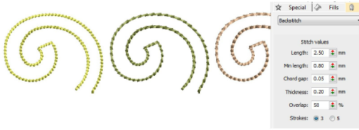

# Decorative outlines

|            | Use Outline > Backstitch to place a row of backstitches along a digitized line. Right-click for settings.              |
| -------------------------------------------------- | ---------------------------------------------------------------------------------------------------------------------- |
|  | Use Outline Stitch Types > Backstitch to place a row of backstitches along a digitized line. Right-click for settings. |
|            | Use Outline > Stemstitch to place a row of stemstitches along a digitized line. Right-click for settings.              |
|  | Use Outline Stitch Types > Stemstitch to place a row of stemstitches along a digitized line. Right-click for settings. |

While simple [run stitching](../../glossary/glossary) is typically used to add borders and pickout runs, there are stitch types for creating decorative outlines. Backstitch is an older-style, adaptable stitch which can be used for delicate outlines. Stemstitch is thicker and can be used to mimic hand-sewn embroidery. Digitize decorative outlines as you would a Run stitch outline. Adjust settings with the Object Properties > Outlines tab.

## Related topics

- [Access object properties](../../Basics/basics/Access_object_properties)
- [Digitizing outlines & details](../../Digitizing/input/Digitizing_outlines_details)
- [Simple run stitching](../../Digitizing/stitches/Simple_run_stitching)
- [Decorative outlines](../../Digitizing/stitches/Decorative_outlines)
