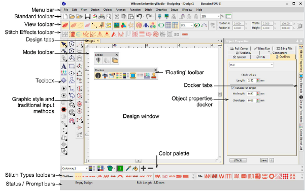

# Design Creation

You can access commands using buttons on the toolbars of your design window. To use a tool, simply move the mouse pointer over it, and click with the left mouse button.

## Related topics

- [Standard tools](Standard_tools)
- [Graphics handling](Graphics_handling)
- [Input methods](Input_methods)
- [Stitch types](Stitch_types)
- [Motifs](Motifs)
- [Stitch effects](Stitch_effects)
- [Carving stamps](Carving_stamps)
- [Automatic digitizing](Automatic_digitizing)
