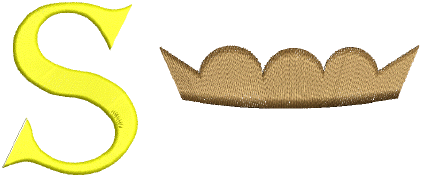

# Digitize columns of turning stitches

|                  | Use Traditional Digitizing > Column A to create columns of varying width and stitch angle. Right-click for settings.                                           |
| ------------------------------------------------ | -------------------------------------------------------------------------------------------------------------------------------------------------------------- |
|  | Use Graphics Digitizing > Digitize Column to create columns of varying width and stitch angle. Right-click for settings.                                       |
|                  | Use Traditional Digitizing > Column B to create asymmetrical columns of turning stitches, where opposite sides are different shapes. Right-click for settings. |

Use the Column A or Digitize Column tools to digitize columns of varying width and [stitch angle](../../glossary/glossary). Use the Column B tool to digitize shapes where one side is different to the other, especially where one side requires more points than the other. Stitches turn evenly throughout the entire shape.

## Related video

<iframe src="https://www.youtube.com/embed/m5Li83Xe24k" frameborder="0" 
		 allow="accelerometer; autoplay; encrypted-media; gyroscope; picture-in-picture" 
		 allowfullscreen="" style="width: 560px; height: 315px;">

&#160;

</iframe>

## Related topics

- [Digitize columns of turning stitches](../../Digitizing/input/Digitize_columns_of_turning_stitches)
- [Digitizing irregular columns](../../Digitizing/input/Digitizing_irregular_columns)
- [Digitize contour fills](../../Decorative/curves/Digitize_contour_fills)
- [Create curved fills with Florentine Effect](../../Decorative/curves/Create_curved_fills_with_Florentine_Effect)
- [Create curved fills with Liquid Effect](../../Decorative/curves/Create_curved_fills_with_Liquid_Effect)
