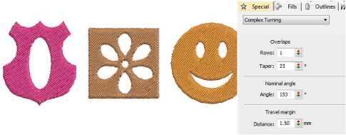

# Digitize free shapes

|  | Use Traditional Digitizing > Complex Fill to digitize filled shapes with a single stitch angle. Right-click for settings.    |
| ------------------------------------------ | ---------------------------------------------------------------------------------------------------------------------------- |
|    | Use Traditional Digitizing > Complex Turning to digitize filled shapes with turning stitch angles. Right-click for settings. |

Digitize free-form shapes with Complex Fill or with Complex Turning. The method is essentially the same:

- Digitize the shape
- Define entry and exit points
- Define stitch angle/s. Complex Turning lets you create multiple stitch angles.

The Object Properties > Special > Complex Fill tab lets you specify values for complex shapes with fixed stitch angles. The Special > Complex Turning tab lets you specify values for complex shapes with turning stitches.

## Related video

<iframe src="https://www.youtube.com/embed/r0oGUefa_-I" frameborder="0" 
		 allow="accelerometer; autoplay; encrypted-media; gyroscope; picture-in-picture" 
		 allowfullscreen="" style="width: 560px; height: 315px;">

&#160;

</iframe>

## Related topics

- [Creating free-form shapes](../../Digitizing/input/Creating_free-form_shapes)
- [Add holes to free-form shapes](../../Digitizing/input/Add_holes_to_free-form_shapes)
- [Set nominal angles](../../Digitizing/input/Set_nominal_angles)
- [Adjust segment overlaps](../../Digitizing/input/Adjust_segment_overlaps)
- [Adjust travel margins](../../Digitizing/input/Adjust_travel_margins)
