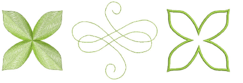

# Digitize open & closed shapes

|      | Use Graphics Digitizing > Digitize Open Shape to digitize open shapes. Press &lt;Ctrl&gt; to constrain.     |
| -------------------------------------------- | ----------------------------------------------------------------------------------------------------------- |
|  | Use Graphics Digitizing > Digitize Closed Shape to digitize closed shapes. Press &lt;Ctrl&gt; to constrain. |

Use the Digitize Open Shape tool to digitize open shapes with any kind of outline stitch. Digitize Open Shape places a row of stitches along a digitized line. This tool is typically used to add borders or details to designs. Digitize free-form closed shapes with the Digitize Closed Shape tool. This tool can be used with either outline or fill stitch types.

## Related video

<iframe src="https://www.youtube.com/embed/FeAn3Ene_Rs" frameborder="0" 
		 allow="accelerometer; autoplay; encrypted-media; gyroscope; picture-in-picture" 
		 allowfullscreen="" style="width: 560px; height: 315px;">

&#160;

</iframe>

## Related topics

- [Digitize open & closed shapes](../../Digitizing/input/Digitize_open_closed_shapes)
- [Digitizing outlines & details](../../Digitizing/input/Digitizing_outlines_details)
- [Digitize motif runs](../../Decorative/motifs/Digitize_motif_runs)
- [Create vectors](../../Automatic/vectors/Create_vectors)
