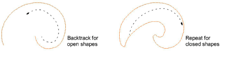

# Digitize outlines & details

|              | Use Traditional Digitizing > Digitize Run to create row of single stitches along a digitized line.                     |
| -------------------------------------- | ---------------------------------------------------------------------------------------------------------------------- |
|  | Use Traditional Digitizing > Backtrack to reinforce an outline, stitching it in the reverse direction to the original. |
|        | Use Traditional Digitizing > Repeat to duplicate an outline in the same direction – typically used with closed shapes. |

EmbroideryStudio provides tools for creating outline stitching of varying thickness and styles. These tools place a row of stitching along a digitized line. They are typically used to add outlines and pickout runs to designs. They can also be used for decorative effect.

Use Backtrack and Repeat to reinforce outlines. Backtrack stitches in reverse direction to the original. It is typically used to make run stitch outlines thicker without creating unwanted connecting stitches. Repeat duplicates the original stitching direction and is typically used with closed shapes.

## Related topics

- [Digitizing outlines & details](../../Digitizing/input/Digitizing_outlines_details)
- [Simple run stitching](../../Digitizing/stitches/Simple_run_stitching)
- [Decorative outlines](../../Digitizing/stitches/Decorative_outlines)
- [Reinforce outlines](../../Quality/quality/Reinforce_outlines)
