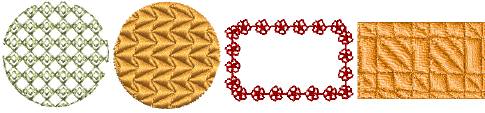
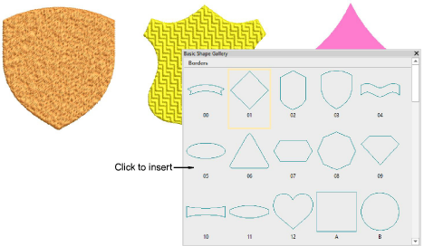
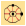
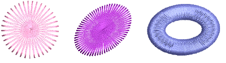

# Digitize regular shapes

|      | Use Graphics Digitizing > Ellipse to digitize ellipse or circle embroidery objects.                                      |
| -------------------------------------- | ------------------------------------------------------------------------------------------------------------------------ |
|  | Use Graphics Digitizing > Rectangle to digitize rectangle or square embroidery objects. Press &lt;Ctrl&gt; to constrain. |

EmbroideryStudio provides digitizing tools for quickly creating regular shapes such as circles and squares, ovals and rectangles.

## Digitize basic shapes

|  | Use Graphics Digitizing > Basic Shapes to digitize basic shapes. Press &lt;Ctrl&gt; to maintain aspect ratio. Press &lt;Shift&gt; to center at the first point. |
| ------------------------------------------ | --------------------------------------------------------------------------------------------------------------------------------------------------------------- |

The Graphics Digitizing toolbar provides a dedicated Basic Shapes tool which allows you to quickly create design objects from a library of preset shapes. These can be created as vector objects, or you can apply the full range of outline and fill stitch types. These can be useful when creating logo designs or embroidered badges. Available shapes are exactly the same as for preset borders. Use Ctrl and Shift keys, alone or in combination, to maintain aspect ratio and center point.

## Digitize circles, stars & rings

|  | Use Traditional Digitizing > Star to digitize star shapes filled with Zigzag stitching. |
| ---------------------------- | --------------------------------------------------------------------------------------- |
|  | Use Traditional Digitizing > Ring to digitize circle and oval-shaped rings.             |

EmbroideryStudio provides special time-saving input tools for creating stars and rings.

## Related video

<iframe src="https://www.youtube.com/embed/FeAn3Ene_Rs" frameborder="0" 
		 allow="accelerometer; autoplay; encrypted-media; gyroscope; picture-in-picture" 
		 allowfullscreen="" style="width: 560px; height: 315px;">

&#160;

</iframe>

## Related topics

- [Digitize regular shapes](../../Digitizing/input/Digitize_regular_shapes)
- [Digitize basic shapes](../../Modifying/productivity/Digitize_basic_shapes)
- [Digitize stars & rings](../../Modifying/productivity/Digitize_stars_rings)
- [Digitize contour fills](../../Decorative/curves/Digitize_contour_fills)
- [Create vectors](../../Automatic/vectors/Create_vectors)
