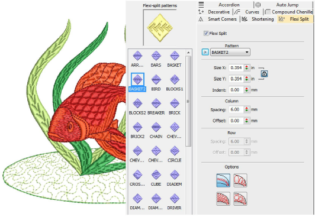

# Flexi-splits

|  | Use Stitch Effects > Flexi Split to create decorative split patterns following stitch angles and scaled according to object width. Right-click for settings. |
| ---------------------------------------- | ------------------------------------------------------------------------------------------------------------------------------------------------------------ |

Flexi Split is a decorative effect where one or more lines of a program split pattern are used in the object fill. It is intended for use with objects with turning stitches or varying column width. Adjust settings with the Object Properties > Effects > Flexi Split tab.

## Related topics

- [Flexi-splits](../../Decorative/curves/Flexi-splits)
