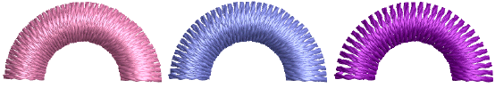

# Fractional spacing

|  | Use Stitch Effects > Fractional Spacing to even out stitch density along outside and inside edges. Right-click to adjust fractional spacing settings. |
| ------------------------------------------------------ | ----------------------------------------------------------------------------------------------------------------------------------------------------- |

Apply fractional spacing to curved shapes to even out stitch density along outside and inside edges. Fractional spacing is particularly useful for columns of satin stitches with sharp turns. For best results, combine [stitch shortening](../../glossary/glossary#stitch-shortening) and fractional spacing effects.

## Related topics

- [Apply fractional spacing](../../Quality/quality/Apply_fractional_spacing)
