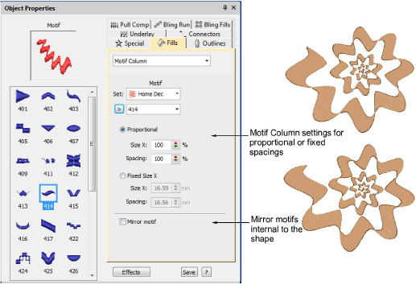

# Graded motif columns

|  | Use Fill Stitch Types > Motif Column to place motifs along the center line of a column shape and resize to fit the shape. Right-clicking for settings. |
| -------------------------------------------- | ------------------------------------------------------------------------------------------------------------------------------------------------------ |

The Motif Column feature allows you to create graded columns of motif stitching. Motifs dynamically resize to fit varying widths. Similar in concept to flexi-split with turning satin, you digitize a tapering shape using, for example, Column A. Apply Motif Column and select a motif. Motifs are automatically ‘enveloped’ to fit to the shape.

## Related video

<iframe src="https://www.youtube.com/embed/viqW8ac9C68" frameborder="0" 
		 allow="accelerometer; autoplay; encrypted-media; gyroscope; picture-in-picture" 
		 allowfullscreen="" style="width: 560px; height: 315px;">

</iframe>

## Related topics

- [Create graded motif columns](../../Decorative/motifs/Create_graded_motif_columns)
