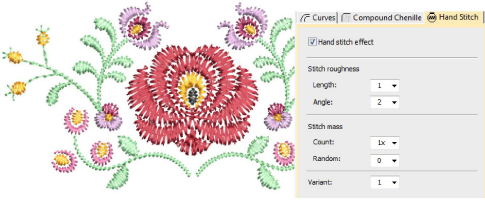

# Hand Stitch

|  | Use Stitch Effects > Hand Stitch to create hand-stitch effects which combine randomized spacing and stitch angles. Can be applied to satin, tatami, run, backstitch, and other stitch types. |
| ---------------------------------------------------- | -------------------------------------------------------------------------------------------------------------------------------------------------------------------------------------------- |

Fashion trends sometimes favor a more organic look which is very hard to achieve with current design tools. With Hand Stitch effect, you can easily create hand-stitch effects which combine randomized stitch length, angle and count.

## Related video

<iframe src="https://www.youtube.com/embed/osMZzz1hWB4" frameborder="0" 
		 allow="accelerometer; autoplay; encrypted-media; gyroscope; picture-in-picture" 
		 allowfullscreen="" style="width: 560px; height: 315px;">

&#160;

</iframe>

## Related topics

- [Organic stitching](../../Decorative/specialty/Organic_stitching)
- [Hand stitch effect](../../Decorative/specialty/Hand_stitch_effect)
