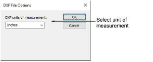

# Import graphics

|  | Use Standard > Import Graphic to import vector graphic or bitmap image into current design |
| ---------------------------------------------- | ------------------------------------------------------------------------------------------ |

[Bitmap](../../glossary/glossary) images of various formats can be imported or pasted into EmbroideryStudio for use as digitizing backdrops. Vector graphics from third-party applications can also be inserted into EmbroideryStudio in a variety of native and interchange vector formats. You can import vector graphics (not DXF) as [bitmaps](../../glossary/glossary). Vector graphics can be converted to embroidery objects using a variety of input methods and with the [Auto-Digitizing](../../glossary/glossary) tools.

## DXF import options

The DXF File Options dialog lets you select inches or millimeters when you insert DXF files into EmbroideryStudio.

## Related video

<iframe src="https://www.youtube.com/embed/5Sqab5N2y8o" frameborder="0" 
		 allow="accelerometer; autoplay; clipboard-write; encrypted-media; gyroscope; picture-in-picture" 
		 allowfullscreen="" style="width: 560px; height: 315px;">

</iframe>

## Related topics

- [Import graphics](....\Automatic\bitmaps\Import_graphics)
- [Insert vector graphics](../../Automatic/vectors/Insert_vector_graphics)
- [Preparing artwork for auto-digitizing](....\Automatic\bitmaps\Preparing_artwork_for_auto-digitizing)
