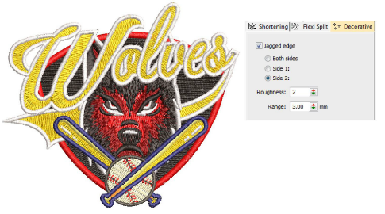

# Jagged edges

|  | Use Stitch Effects > Jagged Edge to create rough edges, shading effects, or imitate fur and other fluffy textures along one or more sides of selected objects. |
| ---------------------------------------- | -------------------------------------------------------------------------------------------------------------------------------------------------------------- |

Use Jagged Edge to create rough edges, shading effects, or imitate fur and other fluffy textures. It can be applied to satin or tatami fills with or without patterns. It doesn’t work with Contour stitch. Adjust settings with the Object Properties > Effects > Decorative tab.

## Related topics

- [Organic stitching](../../Decorative/specialty/Organic_stitching)
- [Jagged edges](../../Decorative/specialty/Jagged_edges)
