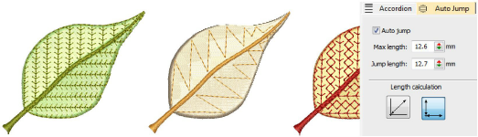

# Long stitches with Auto Jump

|  | Use Stitch Effects > Auto Jump to preserve long stitches in new and selected objects. Right-click to adjust settings. |
| ------------------------------------ | --------------------------------------------------------------------------------------------------------------------- |

Apply Auto Jump to satin objects with stitches that exceed the maximum stitch length. If the cover stitches are short, extending them with a jump makes them looser and thus more effectively raised off the fabric. Auto Jump can be used, for example, with manually digitized underlays. It can also be used to create quilted effects, for example, by applying it to satin areas that are over-stitched with Run stitch or [Motif Fill](../../glossary/glossary). Adjust settings with the Object Properties > Effects > Auto Jump tab.

Warning: Many machines trim by jumps. Thus, to prevent the trimmers being activated, usually only one or two jumps between needle penetrations may be used.

## Related topics

- [Preserve long stitches](../../Quality/quality/Preserve_long_stitches)
