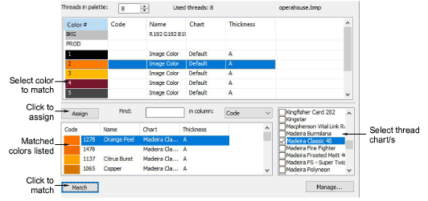

# Match bitmap colors

The Match Bitmap Colors dialog lets you match thread colors manually or automatically to a design or colorway from an inserted bitmap image or vector drawing.

## Related topics

- [Add & match image colors](../../Automatic/bitmaps/Add_match_image_colors)
