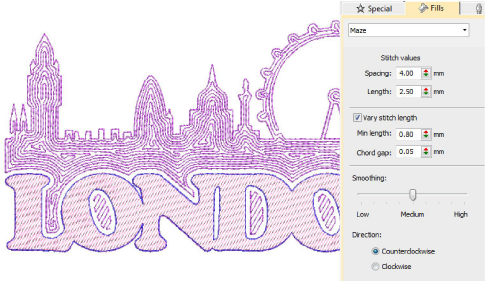

# Maze fills

|  | Use Fill Stitch Types > Maze Fill to create maze-like stitching which follows object contours for open fills. Right-click for settings. |
| ------------------------------------ | --------------------------------------------------------------------------------------------------------------------------------------- |

Automatically fill large areas with double-spiral stitching that never crosses itself with Maze Fill.

## Related video

<iframe src="https://www.youtube.com/embed/VbLn8VujLEI" frameborder="0" 
		 allow="accelerometer; autoplay; encrypted-media; gyroscope; picture-in-picture" 
		 allowfullscreen="" style="width: 560px; height: 315px;">

</iframe>

## Related topics

- [Access object properties](../../Basics/basics/Access_object_properties)
- [Maze fills](../../Decorative/specialty/Maze_fills)
