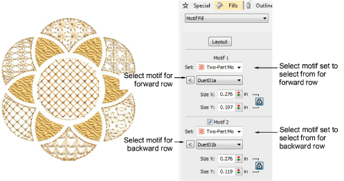

# Motif fills & borders

|            | Use Outline > Motif Run to create a string of motifs along a digitized line.                                                                |
| ---------------------------------------------- | ------------------------------------------------------------------------------------------------------------------------------------------- |
|  | Use Outline Stitch Types > Motif Run to create a string of motifs along a digitized line.                                                   |
|          | Use Fill Stitch Types > Motif Fill to create decorative fills using embroidery motifs to form repeating patterns. Right-click for settings. |

Motifs are predefined design elements, such as hearts, leaves or border patterns. They generally consist of one or more simple objects, and are stored in a special motif set. Motifs can be used for ornamental outlines and patterned fills. Select from a wide range of motifs in the Object Properties docker. Motifs can be scaled, rotated and mirrored in the same way as other objects. You can even use motif fills to create interesting three dimensional effects.

## Related video

<iframe src="https://www.youtube.com/embed/0DexMieX0WQ?si=hgIxX_unCobbSpXV" 
		 title="YouTube video player" frameborder="0" allow="accelerometer; autoplay; clipboard-write; encrypted-media; gyroscope; picture-in-picture; web-share" 
		 allowfullscreen="" style="width: 560px; height: 315px;">

</iframe>

## Video recomendado

## Related topics

- [Access object properties](../../Basics/basics/Access_object_properties)
- [Digitizing outlines & details](../../Digitizing/input/Digitizing_outlines_details)
- [Motif runs](../../Decorative/motifs/Motif_runs)
- [Reshape motif runs](../../Decorative/motifs/Reshape_motif_runs)
- [Motif fills](../../Decorative/motifs/Motif_fills)
- [Motif fill settings](../../Decorative/motifs/Motif_fill_settings)
- [Lay out motif fills on-screen](../../Decorative/motifs/Lay_out_motif_fills_on-screen)
- [Enveloped motif fills](../../Decorative/motifs/Enveloped_motif_fills)
