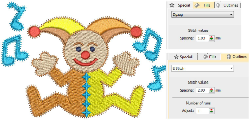

# Open stitching

|          | Use Fill Stitch Types > Zigzag to create fills with an open ‘sawtooth’ effect. Right-click for settings.                                     |
| ------------------------------------------------ | -------------------------------------------------------------------------------------------------------------------------------------------- |
|                | Use Fill Stitch Types > E Stitch to create fills with an open ‘comb’ effect. Right-click for settings.                                       |
|    | Click Outline Stitch Types > Zigzag to create open borders or columns of even width for an open ‘sawtooth’ effect. Right-click for settings. |
|  | Use Outline Stitch Types > E Stitch to create open borders or columns of even width for an open ‘comb’ effect. Right-click for settings.     |

The Stitch Types toolbars include Zigzag and E Stitch stitch types. Both are used to create borders around [appliqués](../../glossary/glossary). Both can also be used for decorative effects or open fills where fewer stitches are required. Zigzag and double zigzag stitches are also frequently used as underlays. Settings can be accessed via Object Properties > Outlines and Object Properties > Fills tabs.

## Related topics

- [Access object properties](../../Basics/basics/Access_object_properties)
- [Decorative borders](../../Decorative/specialty/Decorative_borders)
