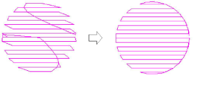

# Open stitching with trapunto

|  | Use Stitch Effects > Trapunto to force underlying travel runs to the edges of a selected object. Right-click to adjust Trapunto settings. |
| ------------------------------------ | ----------------------------------------------------------------------------------------------------------------------------------------- |

The Trapunto effect automatically moves underlying travel runs to the edges of an object so they can’t be seen. It is available with complex fill objects using tatami stitching. In EmbroideryStudio, the effect is typically used in combination with open stitching to fill backgrounds or for shading effects. Without it, travel runs, spacing variations and overlapping rows between segments are visible and can spoil the effect.

Accordion Spacing extends the usefulness of Trapunto by providing a simple way to produce variation in a filled pattern and the illusion of depth. Trapunto and Accordion Spacing can also be combined with Liquid and Florentine effects to produce curved color blending.

::: info Note
Trapunto effect overrides whatever tatami backstitch settings currently apply.
:::

## Related topics

- [Open stitching](../../Decorative/specialty/Open_stitching)
- [Trapunto open stitching](../../Decorative/specialty/Trapunto_open_stitching)
