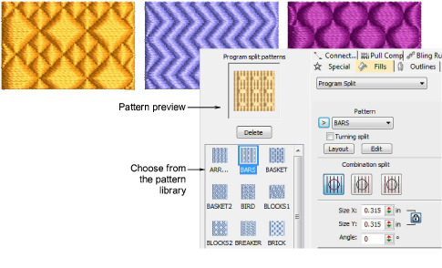
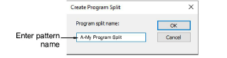

# Patterned stitching

|            | Use Fill Stitch Types > Program Split to create decorative fill stitches where needle penetrations form a tiled pattern.                                  |
| ------------------------------------------------------ | --------------------------------------------------------------------------------------------------------------------------------------------------------- |
|  | Use Outline Stitch Types > Program Split to create borders or columns of even width for decorative needle penetration patterns. Right-click for settings. |

Program Split is a decorative fill stitch where needle penetrations form a tiled pattern. You can apply Program Split to a wide variety of objects. A wide variety of patterns is available from the Object Properties docker. Settings can be accessed via Object Properties > Outlines and Object Properties > Fills tabs.

The Create Program Split dialog lets you create and edit your own patterns to use in program split fills.

## Related topics

- [Access object properties](../../Basics/basics/Access_object_properties)
- [Patterned stitching](../../Digitizing/stitches/Patterned_stitching)
- [Creating textures with program splits](../../Decorative/patterns/Creating_textures_with_program_splits)
- [Apply program splits](../../Decorative/patterns/Apply_program_splits)
- [Apply combination splits](../../Decorative/patterns/Apply_combination_splits)
- [Program split settings](../../Decorative/patterns/Program_split_settings)
- [Lay out program splits on-screen](../../Decorative/patterns/Lay_out_program_splits_on-screen)
- [Make split patterns](../../Decorative/patterns/Make_split_patterns)
