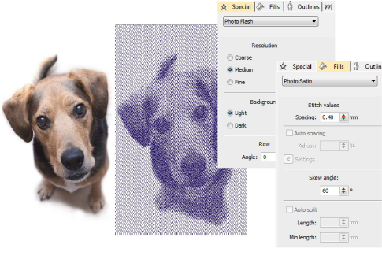

# Photo Flash

|                      | Use Auto-Digitizing > Photo Flash to create embroidery designs directly from photographs.          |
| ------------------------------------------------------------ | -------------------------------------------------------------------------------------------------- |
|  | Use Mode > Tag as Photo Flash to convert photos to Photo Flash embroidery from CorelDRAW Graphics. |

Use Photo Flash to create embroidery from photographs or other images, color or grayscale. Color images are automatically converted to grayscale. Photo Flash designs consist of rows of stitches of varying spacing settings. The effect resembles the output of a line printer.

In CorelDRAW Graphics, the Mode toolbar also includes a Tag as Photo Flash icon which allows you to convert photos to Photo Flash embroidery.

Photo Satin stitch is used almost exclusively with the Photo Flash feature. Adjust stitch settings with the Object Properties > Fills > Photo Satin tab. The Special > Photo Flash tab lets you specify the values for max width, row spacing, background and fill stitch angle for Photo Flash objects.

## Related topics

- [Auto-digitize with Photo Flash](../../Automatic/automatic/Auto-digitize_with_Photo_Flash)
