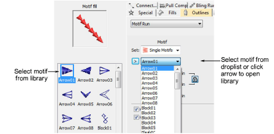

# Place individual motifs

|  | Use Traditional Digitizing > Use Motif to add motifs to design one-by-one. Rotate, scale, or mirror as you add. |
| ------------------------------------ | --------------------------------------------------------------------------------------------------------------- |

Motifs are commonly used in decorative outlines or open fills. However, you can add them to your design one-by-one. Rotate, scale, or mirror them as you add or edit them like any other object. Select the motif you wish to use from the Outlines > Motif Run tab of the Object Properties docker.

## Related topics

- [Selecting & placing motifs](../../Decorative/motifs/Selecting_placing_motifs)
