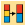
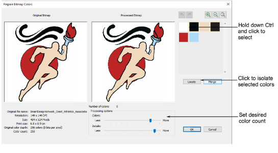

# Prepare artwork

|  | Use Auto-Digitizing > Prepare Bitmap Colors to reduce the number of colors and remove image ‘noise’ in non-outlined images. |
| ------------------------------------------------------ | --------------------------------------------------------------------------------------------------------------------------- |

The Auto-Digitizing tools provide everything necessary to automatically digitize shapes in electronic [artwork](../../glossary/glossary) without using manual input methods. Even if your artwork looks ready to stitch when inserted into the software, however, it will need to be image-processed before conversion.

Use the Prepare Bitmap Colors tool to prepare images for automatic digitizing. This function automatically flattens colors, sharpens outlines, and reduces ‘noise’. Areas enclosed by a black outline are reduced to a single color. This makes it easier for the software to recognize distinct areas in the artwork. These areas then become the embroidery objects of the finished design.

## Related video

<iframe src="https://www.youtube.com/embed/rJo6CWJ5uFU" frameborder="0" 
		 allow="accelerometer; autoplay; encrypted-media; gyroscope; picture-in-picture" 
		 allowfullscreen="" style="width: 560px; height: 315px;">

&#160;

</iframe>

## Related topics

- [Preparing images for auto-digitizing](../../Automatic/bitmaps/Preparing_images_for_auto-digitizing)
