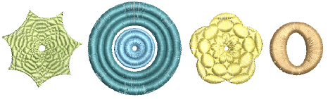

# Radial fills

|  | Use Stitch Effects > Radial Fill to create radial turning stitching with available stitch types. |
| ---------------------------------------- | ------------------------------------------------------------------------------------------------ |

Radial Fill creates radial turning stitching in either Satin or Tatami objects. Stitches are generated from the outside edge to the geometric center. The center can be shifted. The effect may be on or off while digitizing. Shaping operations such as Mirror Merge or Remove Overlaps preserve the effect.

## Related topics

- [Radial fills](../../Decorative/curves/Radial_fills)
