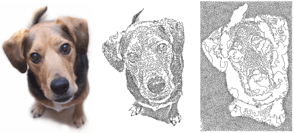

# Reef PhotoStitch

|  | Use Auto-Digitizing > Reef PhotoStitch to turn photographs into a single embroidery field resembling a coral reef. |
| -------------------------------------------------- | ------------------------------------------------------------------------------------------------------------------ |

Reef PhotoStitch expands on the Photo Flash auto-digitizing method to convert a photos into embroidered images. Automatically fill large areas with open stitching reminiscent of a coral reef. Adjust to the stitch resolution of choice.

## Related video

<iframe src="https://www.youtube.com/embed/kIrwjYuaj_c" frameborder="0" 
		 allow="accelerometer; autoplay; encrypted-media; gyroscope; picture-in-picture" 
		 allowfullscreen="" style="width: 560px; height: 315px;">

</iframe>

## Related video

<iframe src="https://www.youtube.com/embed/QCeDOsxuag0" frameborder="0" 
		 allow="accelerometer; autoplay; encrypted-media; gyroscope; picture-in-picture" 
		 allowfullscreen="" style="width: 560px; height: 315px;">

</iframe>

## Related video

<iframe src="https://www.youtube.com/embed/FfkXudzg6s8" title="YouTube video player" 
		 frameborder="0" allow="accelerometer; autoplay; clipboard-write; encrypted-media; gyroscope; picture-in-picture" 
		 allowfullscreen="" style="width: 560px; height: 315px;">

</iframe>

## Related topics

- [Auto-digitize with Reef PhotoStitch](../../Automatic/automatic/Auto-digitize_with_Reef_PhotoStitch)
