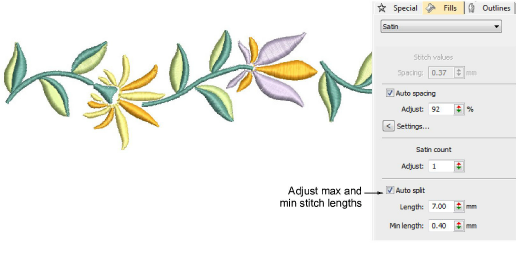
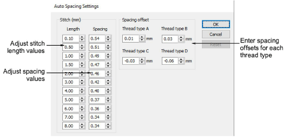

# Satin stitching

|                    | Use Fill Stitch Types > Satin to apply satin stitch to new or selected narrow columns and shapes. Right-click for settings.                                        |
| -------------------------------------------------------- | ------------------------------------------------------------------------------------------------------------------------------------------------------------------ |
|        | Use Fill Stitch Types > Satin Raised to create raised surfaces – can be applied to lettering or used with trapunto for quilting effects. Right-click for settings. |
|              | Use Outline Stitch Types > Satin to create thicker borders or columns of even thickness. Right-click for settings.                                                 |
|  | Use Outline Stitch Types > Satin Raised to create raised satin borders – can be used with outlines for quilting effects. Right-click for settings.                 |

Satin is one of those stitch types which can be used for thicker borders or for fills. It is well-suited to narrow shapes where each stitch spans the width of the column. Because there are generally no needle penetrations breaking up the fill, satin stitch gives a glossy, high-quality appearance. With Satin Raised you can also adjust the number of layers of stitching. Adjust settings with the Object Properties > Fills > Satin tab.

The Auto Spacing Settings dialog lets you specify how rapidly the spacing changes, and by how much, by changing the stitch length and spacing values.

Note: Embroidery machines have a maximum possible stitch length which is determined by the physical frame movement. If a stitch exceeds this, it is generally broken into smaller stitches of equal length. The line formed by needle penetrations can affect the appearance of the embroidery, especially satin fills. Auto Split breaks long satin stitches into shorter ones.

## Related video

<iframe src="https://www.youtube.com/embed/tU3ui7L6uNA" title="YouTube video player" 
		 frameborder="0" allow="accelerometer; autoplay; clipboard-write; encrypted-media; gyroscope; picture-in-picture" 
		 allowfullscreen="" style="width: 560px; height: 315px;">

&#160;

</iframe>

## Related video

<iframe src="https://www.youtube.com/embed/L7p3nAupGH0" frameborder="0" 
		 allow="accelerometer; autoplay; encrypted-media; gyroscope; picture-in-picture" 
		 allowfullscreen="" style="width: 560px; height: 315px;">

&#160;

</iframe>

## Related topics

- [Access object properties](../../Basics/basics/Access_object_properties)
- [Satin stitching](../../Digitizing/stitches/Satin_stitching)
- [Satin auto-spacing](../../Digitizing/stitches/Satin_auto-spacing)
- [Satin fixed spacing](../../Digitizing/stitches/Satin_fixed_spacing)
- [Satin stitch count](../../Digitizing/stitches/Satin_stitch_count)
- [Split satin stitches](../../Quality/quality/Split_satin_stitches)
- [Satin lettering](../../Lettering/lettering_advanced/Applying_stitch_types_effects_to_lettering)
