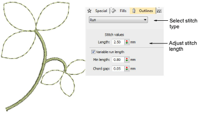

# Simple runs

|                    | Use Outline Stitch Types > Run to place a row of single run stitches along a digitized line. Right-click for settings.                   |
| ------------------------------------------------------ | ---------------------------------------------------------------------------------------------------------------------------------------- |
|          | Use Outline Stitch Types > Triple Run to place a triple row of run stitches along a digitized line. Right-click for settings.            |
|  | Use Outline Stitch Types > Sculpture Run to create a thick-thin outline alternating single and triple stitches for a hand-stitched look. |

Use Run to digitize lines of simple [run stitching](../../glossary/glossary). Use Triple Run for emphasis. This stitch type is typically used for thicker borders and outlines. Sculpture Run creates thick-thin alternating single and triple stitching for a hand-stitched look. Adjust [stitch length](../../glossary/glossary), chord gap, stitch repetitions, and other settings via the Object Properties docker.

## Related video

<iframe src="https://www.youtube.com/embed/uxLFSloo7A0" frameborder="0" 
		 allow="accelerometer; autoplay; encrypted-media; gyroscope; picture-in-picture" 
		 allowfullscreen="" style="width: 560px; height: 315px;">

&#160;

</iframe>

## Related topics

- [Access object properties](../../Basics/basics/Access_object_properties)
- [Digitizing outlines & details](../../Digitizing/input/Digitizing_outlines_details)
- [Simple run stitching](../../Digitizing/stitches/Simple_run_stitching)
- [Stitch length settings](../../Digitizing/stitches/Stitch_length_settings)
- [Run count setting](../../Digitizing/stitches/Run_count_setting)
