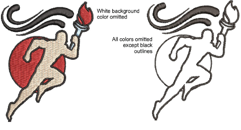

# Smart Design

|                            | Use Auto-Digitizing > Smart Design to create embroidery designs directly from imported artwork.                |
| -------------------------------------------------------------------- | -------------------------------------------------------------------------------------------------------------- |
|              | Use Auto-Digitizing > Instant Smart Design to automatically create embroidery from imported artwork instantly. |
|  | Use Auto-Digitizing > Keep Graphic Objects to retain the original artwork during conversion.                   |

In essence, creating an embroidery design with Smart Design tools is simply a matter of selecting a graphic – [bitmap](../../glossary/glossary) or [vector](../../glossary/glossary) – and converting it to embroidery. An extension of Auto-Digitizing technology, Smart Design recognizes shapes and makes decisions about the most suitable object types and stitch types to use. It also determines stitching sequence based on closest join. [Artwork](../../glossary/glossary) is effectively ‘batch processed’ to create the many embroidery objects that make up a design.

Even if an image has not been preprocessed, Instant Smart Design will automatically process and convert it using default settings. This is very useful for stitch estimates. For more control over object conversion, use the Smart Design method. This can also be used as a starting point for embroidery digitizing. Once created, edit final results using available [digitizing](../../glossary/glossary) and editing techniques. Always remember to apply underlays. You may also need to reshape and resequence some objects.

## Related video

<iframe src="https://www.youtube.com/embed/N45qjepfea4" frameborder="0" 
		 allow="accelerometer; autoplay; encrypted-media; gyroscope; picture-in-picture" 
		 allowfullscreen="" style="width: 560px; height: 315px;">

&#160;

</iframe>

## Related video

<iframe src="https://www.youtube.com/embed/rJo6CWJ5uFU" frameborder="0" 
		 allow="accelerometer; autoplay; encrypted-media; gyroscope; picture-in-picture" 
		 allowfullscreen="" style="width: 560px; height: 315px;">

&#160;

</iframe>

## Related topics

- [Auto-digitizing images](....\Automatic\automatic\Auto-digitizing_images)
