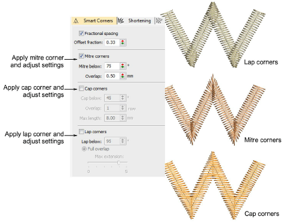

# Smart corners

|  | Use Stitch Effects > Mitre Corners to create sharp lines at intersections of two columns. Right-click to adjust settings. |
| -------------------------------------------- | ------------------------------------------------------------------------------------------------------------------------- |
|      | Use Stitch Effects > Cap Corners with very sharp corners to generate fewer stitches. Right-click to adjust settings.      |
|      | Use Stitch Effects > Lap Corners for ‘Tidori’ style stitching. Right-click to adjust settings.                            |

Use the Smart Corners feature to reduce the number of stitches and risk of bunched, distorted embroidery in sharp corners. Mitre Corners creates a sharp line at the intersection of two columns. Use it primarily for corner angles of 75° to 90°. Cap Corners is suitable for very sharp corners as it generates fewer stitches. Lap Corners is suitable for ‘Tidori’ style stitching. It can be applied to [Column C](../../glossary/glossary) and appliqué objects. Adjust settings with the Object Properties > Effects > Smart Corners tab.

## Related topics

- [Controlling corner stitching](../../Quality/quality/Controlling_corner_stitching)
- [Apply Smart Corners](../../Quality/quality/Apply_Smart_Corners)
- [Adjust smart corner settings](../../Quality/quality/Adjust_smart_corner_settings)
- [Round sharp corners](../../Quality/quality/Round_sharp_corners)
- [Apply fractional spacing](../../Quality/quality/Apply_fractional_spacing)
