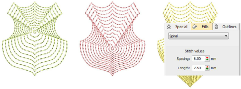

# Spiral fills

|  | Use Fills Stitch Types > Spiral Fill to create spiral stitching from the center of any filled object. |
| ---------------------------------------- | ----------------------------------------------------------------------------------------------------- |

Spiral Fill works best for ‘blobby’ shapes but can be applied to longer shapes. With longer shapes it may generate stitches that go outside the perimeter of the object, but this can provide for some interesting visual effects. The center of the spiral can be moved with the Reshape Object tool. Adjust settings with the Object Properties > Fills > Spiral tab.

## Related video

<iframe src="https://www.youtube.com/embed/ymGpdFO2bp4" frameborder="0" 
		 allow="accelerometer; autoplay; encrypted-media; gyroscope; picture-in-picture" 
		 allowfullscreen="" style="width: 560px; height: 315px;">

</iframe>

## Related video

<iframe src="https://www.youtube.com/embed/alTI1Q9UkGQ" frameborder="0" 
		 allow="accelerometer; autoplay; encrypted-media; gyroscope; picture-in-picture" 
		 allowfullscreen="" style="width: 560px; height: 315px;">

</iframe>

## Related topics

- [Access object properties](../../Basics/basics/Access_object_properties)
- [Spiral fills](../../Decorative/curves/Spiral_fills)
