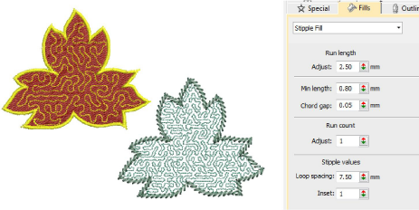

# Stipple fills

|                      | Use Fill Stitch Types > Stipple Fill to create stippled fills of run stitching which meanders more or less randomly within a border. Right-click for settings. |
| -------------------------------------------------------------- | -------------------------------------------------------------------------------------------------------------------------------------------------------------- |
|  | Use Fill Stitch Types > Stipple Backstitch to create a backstitch fill which meanders randomly within a border. Right-click for settings.                      |
|  | Use Fill Stitch Types > Stipple Stemstitch to create a stemstitch fill which meanders randomly within a border. Right-click for settings.                      |

Stippling is a method for creating textured fills of run stitching which meanders more or less randomly within a border. It can be applied to closed objects with a single stitch angle. You control stitch density in stipple objects by adjusting stitch length and loop spacing. Stipple fill objects can be reshaped like any other complex shape object. Adjust settings with the Object Properties > Fills > Stipple Fill tab.

## Related topics

- [Access object properties](../../Basics/basics/Access_object_properties)
- [Stippling effects](../../Decorative/specialty/Stippling_effects)
