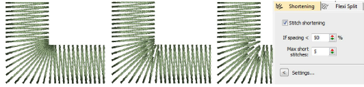

# Stitch shortening

|  | Use Stitch Effects > Shortening to reduce stitch bunching in tight curves by shortening some stitches on the inside edge. Right-click to adjust stitch shortening settings. |
| ---------------------------------------- | --------------------------------------------------------------------------------------------------------------------------------------------------------------------------- |

Apply stitch shortening to sharp corners to decrease density on the inside edge. [Default](../../glossary/glossary) settings suit most designs. Advanced users can override with custom settings. Adjust settings with the Object Properties > Effects > Shortening tab.

## Related video

<iframe src="https://www.youtube.com/embed/qGkIuSS5Bk0" frameborder="0" 
		 allow="accelerometer; autoplay; encrypted-media; gyroscope; picture-in-picture" 
		 allowfullscreen="" style="width: 560px; height: 315px;">

</iframe>

## Related topics

- [Apply stitch shortening](../../Quality/quality/Apply_stitch_shortening)
